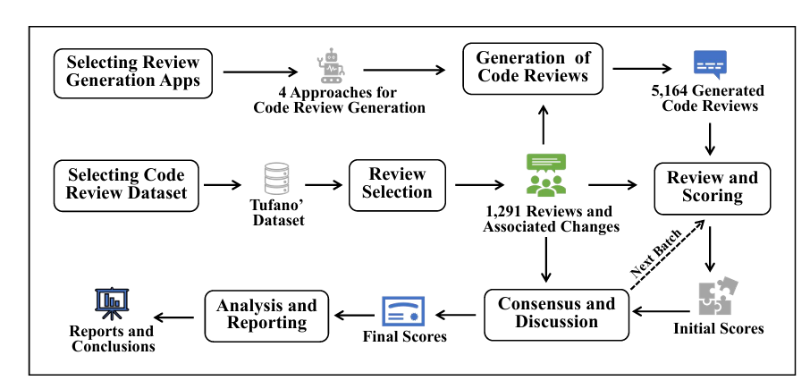

# Replication package of the work: Deep Assessment of Code Review Generation Approaches: Beyond Lexical Similarity

In this paper, we explore how semantic similarity between generated and reference reviews can enhance the automated assessment of code reviews. We first present a benchmark called GradedReviews, which is constructed by collecting real-world code reviews from open-source projects, generating reviews using state-of-the-art approaches, and manually assessing their quality. We then evaluate existing metrics for code review assessment using this benchmark, revealing their limitations.

# Directory Structure
There are two folders within the replication package:

./Code: The source code of deep assessment of code review generation approach

./DataSet: Data to replicate the evaluation in the paper

# DataSet:
The methodology used for constructing the benchmark

# Code: 
Step-by-step running deep assessment of code review generation approaches:

1. BLEU Score:

    `python BLEU.py`

2. Embedding-based Score:
   
   `python embeddingScore.py`

4. LLM-based Score (ChatGPT-4o):
   
    `python LLMScore.py`

6. Decision Tree:
   
    `DecisionTree.py`

7. Spearman Rank Correlation Coefficient:

   `python spearman.py`

8. Kolmogorov-Smirnov Statistic:

   `python ks.py`

9. MENTER Score:

   `python MENTER.py`
   
10. ROUGE Score:

    `python ROUGE.py`

11. LLM-based Score (DeepSeek-Coder):

    `python ScoreByDeepSeek.py`
