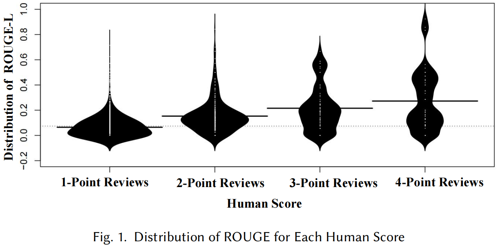

# Additional Research Questions to Be Included in the Camera-Ready Version

**RQ5: Additional Lexical Similarity-based Metrics**

Besides BLEU, researchers also employ other lexical similarity-based metrics, e.g., METEOR[1] and ROUGE[2], to assess the quality of generated code reviews. ROUGE[2] is a widely used automatic recall-oriented metric. It measures the overlap of various linguistic units, including n-grams, word pairs, and sequences. METEOR[1] is grounded in the principle of unigram matching, incorporating precision, recall, and an alignment score that evaluates how well the word order aligns with the reference. Although the previous evaluation results suggest that BLEU alone is often inaccurate in distinguishing high-quality code reviews, it remains unclear whether other lexical similarity-based metrics are accurate or not. To this end, in this section, we evaluate the performance of additional lexical similarity-based metrics, i.e., METEOR and ROUGE, in the automated assessment of code reviews. 

    

    

To evaluate the accuracy of ROUGE and METEOR in assessing generated code reviews, with the open-source implemations[3], we automatically compute ROUGE and METEOR for each of the generated code reviews we collected for the evaluation. After that, we draw the distribution of ROUGE and METEOR  for reviews with different scores in Fig.1 and Fig.2, respectively. Each bean in the graph represents the ROUGE/METEOR score distribution for reviews with a specific score, such as 1-point reviews. From Fig.1, observe that the beans overlap heavily. For instance, the ROUGE scores for 2-point reviews range from 0 to 0.84, which significantly overlaps with the range of ROUGE scores for 1-point reviews (from 0 to 0.71) and the range for 3-point reviews (from 0 to 0.67). It may suggest that it could be challenging to distinguish high-quality reviews (i.e., those with high human scores) from low-quality ones (i.e., those with low human scores). We also observe from Fig.2 that the beans (distribution of METEOR) also heavily overlap. For example, the MENTER scores for 2-point reviews range from 0 to 0.85, overlapping with the range of MENTER scores for 1-point reviews (from 0 to 0.69) and the range for 3-point reviews (from 0 to 0.82). This considerable overlap makes it challenging, if not impossible, to accurately infer human scores based solely on  ROUGE or METEOR alone. 

On the other side, however, we also observe the positive correlation between human scores and ROUGE/METEOR. For example, the median ROUGE score increases with the increase of human scores. The medians for reviews graded 1, 2, 3, and 4 are 0.06, 0.13, 0.19, and 0.20, respectively. The median MENTER score follows a similar trend, with medians for reviews graded 1, 2, 3, and 4 being 0.04, 0.08, 0.14, and 0.15, respectively.  

    

To have a quantitative and objective assessment of the correlation between human scores and ROUGE/METEOR, we compute the Spearman Rank Correlation between them as shown in Table 1. Our computation results suggest that the Spearman Rank Correlation Coefficient between ROUGE scores and human scores is 0.25 where the p-value is significantly below 0.05. It may suggest that ROUGE scores are positively related to human scores, but the correlation is weak.  The same is true for METEOR scores whose Spearman Rank Correlation Coefficient with human scores is 0.21, indicating a positive yet weak correlation. 

We conclude based on the preceding analysis that ROUGE and METEOR are similar to BLEU in that they are only weakly correlated to human scores. 

**Reference:**

[1] Satanjeev Banerjee and Alon Lavie. 2005. METEOR: An automatic metric for MT evaluation with improved correlation with human judgments. In Proceedings of the ACL workshop on intrinsic and extrinsic evaluation measures for machine translation and/or summarization. 65–72.

[2] Rouge: A package for automatic evaluation of summaries. In Text summarization branches out. 74–81.

[3] Sakib Haque, Zachary Eberhart, Aakash Bansal, and Collin McMillan. 2022. Semantic similarity metrics for evaluating source code summarization. In Proceedings of the 30th IEEE/ACM International Conference on Program Comprehension. 36–47
