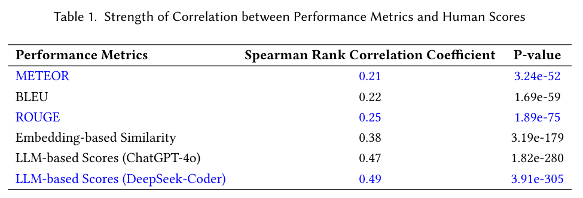

# Additional Research Questions to Be Included in the Camera-Ready Version

**RQ6: Open-Source Large Language Model**

The evaluation in the previous sections suggests that ChatGPT-based scores have a stronger correlation with human scores than lexical similarity-based metrics. In this section, we investigate whether we can replace the closed-source ChatGPT with open-source LLMs while keeping a strong correlation with human scores. To this end, in this section, we replace ChatGPT with DeepSeek-Coder[1], a well-known open-source large language model. Notably, we reuse all of the prompts for ChatGPT and employ the default settings of DeepSeek-Coder. 

    

To have a quantitative and objective assessment of the correlation between DeepSeek-Coder-based scores and human scores, we compute the Spearman Rank Correlation between them as shown in Table 1. **The Spearman Rank Correlation Coefficient is 0.49, much larger than those of the lexical similarity-based scores (e.g., 0.21 of METEOR, 0.22 of BLEU, and 0.25 of ROUGE). It is even slightly greater than that (0.47) of ChatGPT-based scores.** The results may suggest that ChatGPT could be safely replaced with open-source LLMs like DeepSeek-Coder while keeping the strong correlation between LLM-based scores and human scores. It also suggests that the proposed approach can work well with various LLMs. 

    

To visualize the consistency between DeepSeek-Coder-based scores and human scores, we present a heatmap of their overlap in Fig.1. From this figure, we observe that the data distribution is primarily concentrated along the diagonal, suggesting that DeepSeek-Coder-based scores are often aligned with human scores. We also use the Kolmogorov-Smirnov (K-S) statistic[2] to evaluate whether the distributions of DeepSeek-Coder-based scores significantly differ across reviews of different quality levels. Results are presented in Table 2. From this table, we observe that  DeepSeek-Coder is effective in seperating reviews of different quality levels. The KS values of DeepSeek-Coder are comparable to those of ChatGPT, suggting that they have comparable ability in seperating reviews of different quality levels. 

    

We conclude based on the preceding analysis that ChatGPT could be safely replaced with the state-of-the-art open-source LLMs concerning the proposed LLM-based scoring approach. 

**Reference:**

[1] Daya Guo, Qihao Zhu, Dejian Yang, Zhenda Xie, Kai Dong, Wentao Zhang, Guanting Chen, Xiao Bi, Yu Wu, YK Li, et al. 2024. DeepSeek-Coder: When the Large Language Model Meets Programming–The Rise of Code Intelligence. arXivpreprint arXiv:2401.14196 (2024)

[2] Giovanni Fasano and Alberto Franceschini. 1987. A multidimensional version of the Kolmogorov–Smirnov test. Monthly Notices of the Royal Astronomical Society 225, 1 (1987), 155–170.
