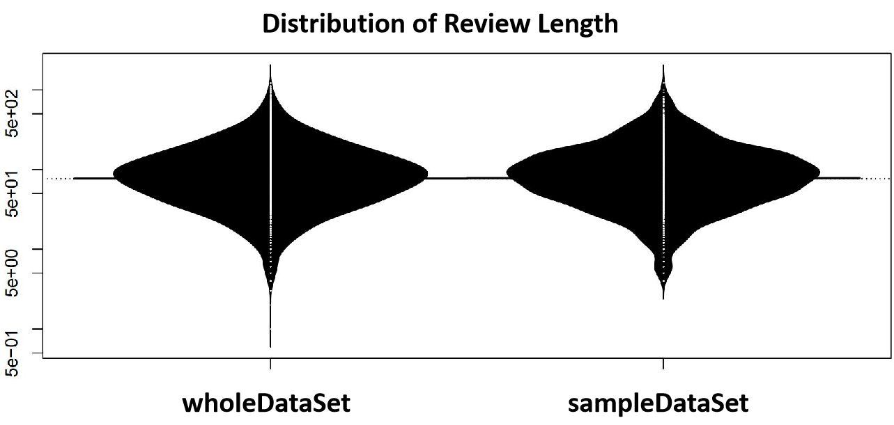
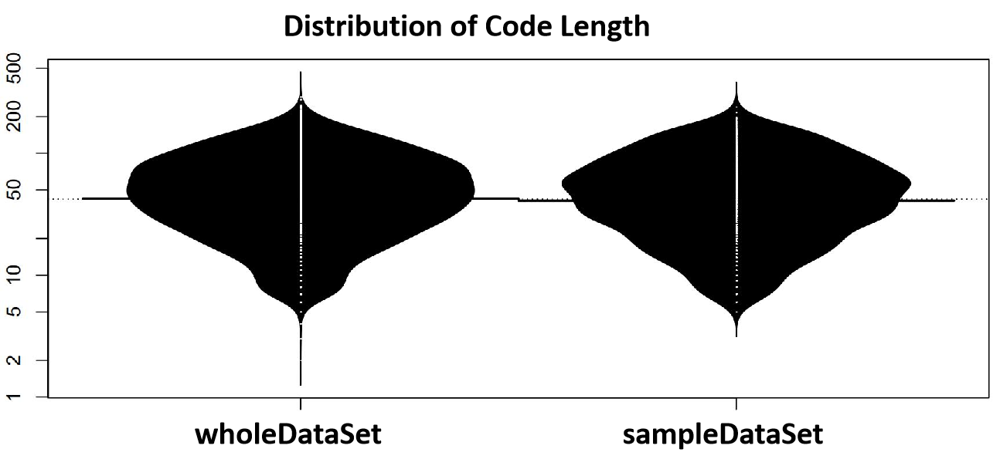

    

We validate with Kolmogorov-Smirnov (KS) tests whether the samples are representative concerning various properties, e.g., length of code reviews. The results of the tests suggested that the sample (SA) and the population (P) from which it was sampled have no significant difference in data distribution concerning the length of code reviews (p=0.9609774149018795>>0.05).   

    

We also validate with Kolmogorov-Smirnov (KS) tests whether the samples are representative concerning various properties, e.g., length of the reviewed source code. The results of the tests suggested that the sample (SA) and the population (P) from which it was sampled have no significant difference in data distribution concerning the length of the reviewed source code (p=0.27236399516079324 >> 0.05). 
