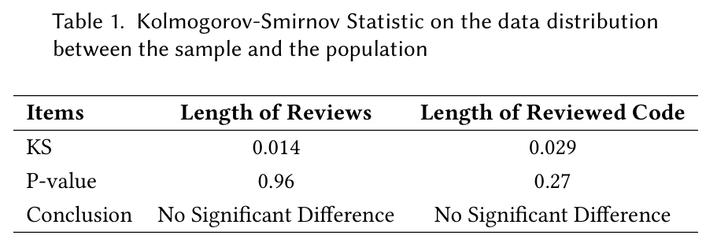

    

We validate with Kolmogorov-Smirnov (KS) tests whether the samples are representative concerning various properties, e.g., length of code reviews. The results of the tests suggested that the sample (sampleDataset) and the population (wholeDataSet) from which it was sampled have no significant difference in data distribution concerning the length of code reviews (p=0.9609774149018795>>0.05). 
The Kolmogorov-Smirnov (KS) test on the length of the reviewed source code  also confirms that sampleDataset and wholeDataSet  have no significant difference in data distribution concerning the length of the reviewed source code since p=0.27236399516079324 >> 0.05.

We also visualize the data distribution of the sample and the population in Fig.1 and Fig.2. From these figures, we can observe a significant difference in their distributions, concerning the length of reviews or the length of reviewed source code. It further confirms the representativeness of the sample. 

    

    

